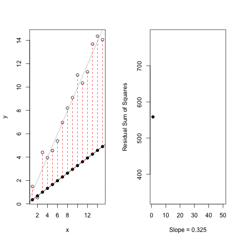
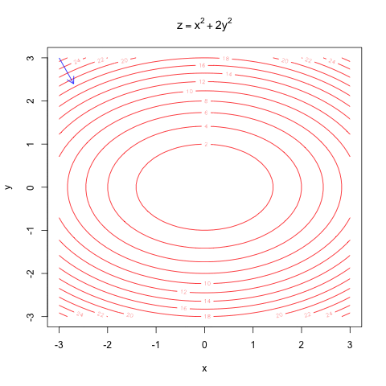

Approaches to fitting non-linear models
===
author: Etienne Low-Décarie
date: 13 July 2018
width: 1280
height: 800

Gettint to know each other
===


<div align="center">
You?
<div>

***

Workshop
- Peer teaching and coding
  - I am one of your peers... correct me when I am wrong.
- Post its
- Challenges


Schedule
===

<small>
- least-squares optimisation
- linear models of curves and linearization
- **~10:30AM - 30 minute coffee break**
- non-linear least squares
- **~12:30PM - 60 minute lunch break**
</small>

***

<small>
- maximum likelihood approaches
- expansions
- other approaches to estimating prediction error
  - boostrapping
  - Monte-Carlo simulations
- **~15:30AM - 30 minute break**
- Dojo and/or work on your data
</small>
 
Data sets
===

`agridat::carmer.density`  
`FSA::Ecoli`  
`?nls`

a package dedicated to this kind of datasets:

```r
require(NISTnls)
help(package="NISTnls")
```

***


```r
plot(Thurber)
```


Simulating your data
===

Good for learning and testing:
- we will know the true functional form
- we will know error is normally distributed
  - or choose another error distribution


Simulating your data : quadratic
===

\[y=ax^2+bx+cx+error\]

Curved but linear in parameters

```r
x <- 1:100
a <- 0.005 ; b <- -0.5 ; c <- 10
quadratic_data <- data.frame(x=x,
                            y=a*x^2+b*x+c+rnorm(length(x)))
```
each term is either a constant or the product of a parameter and a predictor variable, the predictor variable can be transformed in one of the terms (log, squared, inverse...) 

***


```r
plot(quadratic_data)
```


Simulating your data: exponential
===

curved and non-linear in parameters, but transformable

\[N_t = N_0e^{(rt)}\]


```r
x <- 1:100
a <- 2 ;b <- 0.03
exp_data <- data.frame(x=x,
                            y=a*exp(b*x)+rnorm(length(x)))
```
here, *e* is raised to the power of the product of a parameter and a predictor variable

***


```r
plot(exp_data)
```


Simulating your data
===

curved and non-linear in parameters: gaussian function

\[y = a*e^{-\frac{(x-b)^2}{2*c^2}}\]


```r
x <- 1:100
a <- 10 ; b <- 50 ; c <- 0.1
gaussian_data <- data.frame(x=x,
                            y=a*exp(-((x-b)^2)/2*c^2)+rnorm(length(x)))
```
here, the square is taken of difference between a parameter and a predictor variable, *e* is raised to the power of a ratio that includes parameters and a predictor variable,...
***


```r
plot(gaussian_data)
```


Simulating your data : logistic growth
===

\[N_t = \frac{K}{1+(\frac{K}{N_0}-1)e^{(-rt)}}\]

curved and non-linear in parameters

```r
t <- 1:100
P0 <- 5 ; K <- 100 ; r <- 0.08
logistic_growth_data <- data.frame(x=t,
                            y=(K*P0*exp(r*t))/(K+P0*(exp(r*t)-1))+5*rnorm(length(t)))
```

***


```r
plot(logistic_growth_data)
```


Simulating your data
===

Convoluted (many parameters) : Fourier 

\[a*cos(x + b) + (c * cos(d*x + e) + f  )\]


```r
x <- 1:100
conv2_data = data.frame(x=x,
                        y=1 * cos(x + 2) + (3 * cos(2*x + 4) + 5))
```

***


```r
plot(conv2_data)
lines(conv2_data)
```


  
Least-squares optimisation
===


Least-squares optimisation
===


Least-squares optimisation
===


```r
require(animation)
saveGIF(least.squares(),
        movie.name="least_squares.gif")
```

```
[1] TRUE
```

***




Least-squares optimisation multiple dimensions
===


```
[1] TRUE
```

***



Linearization
===

- segmentation
- transformation
- I()

Linearization : segmentation
===

```r
require(segmented)
lm_fit <- lm(cells~days,
                  data=FSA::Ecoli)
plot(cells~days,
     data=FSA::Ecoli)
lines(FSA::Ecoli$days, predict(lm_fit), col="red")
```


Linearization : segmentation
===

```r
segmented_fit <- segmented(lm_fit)
plot(cells~days,
     data=FSA::Ecoli)
lines(FSA::Ecoli$days, predict(segmented_fit), col="red")
```


Linearization : segmentation
===

```r
summary(segmented_fit)
```

```

	***Regression Model with Segmented Relationship(s)***

Call: 
segmented.lm(obj = lm_fit)

Estimated Break-Point(s):
   Est. St.Err 
 6.031  1.155 

Meaningful coefficients of the linear terms:
            Estimate Std. Error t value Pr(>|t|)   
(Intercept)  -1.9839     0.6019  -3.296  0.03005 * 
days          1.3131     0.1546   8.496  0.00105 **
U1.days      -1.2943     0.9274  -1.396       NA   
---
Signif. codes:  0 '***' 0.001 '**' 0.01 '*' 0.05 '.' 0.1 ' ' 1

Residual standard error: 0.6466 on 4 degrees of freedom
Multiple R-Squared: 0.9657,  Adjusted R-squared: 0.9399 

Convergence attained in 2 iterations with relative change -9.370854e-16 
```

Linearization: transformation
===


```r
plot(log(y)~x, data=exp_data)
```


Linearization: transformation
===


```r
lm_exp_fit <- lm(log(y)~x,
                 data=exp_data)
plot(exp_data)
lines(exp_data$x, exp(predict(lm_exp_fit)), col="red")
```


Linearization: transformation
===
problems?


```r
par(mfrow=c(2,2))
plot(lm_exp_fit)
```


```r
par(mfrow=c(1,1))
```

Linearization: curved linear models I()
===


```r
lm_quadratic_fit <- lm(y~x+I(x^2), data=quadratic_data)
plot(quadratic_data)
lines(quadratic_data$x, predict(lm_quadratic_fit), col="red")
```


Linearization: curved linear models I()
===

problems?

```r
par(mfrow=c(2,2))
plot(lm_quadratic_fit)
```


```r
par(mfrow=c(1,1))
```

Challenges
===

- Compare segmentation to transformation for `exp_data`
- Try fitting:
  - `gaussian_data`
  - `logistic_growth_data`
  - or even `conv2_data`
- with a combination of
  - segmentation
  - linear fitting of a curve using `I()`
  - and/or transformation


Nonlinear least-squares using nls()
===

Exponential

```r
nls_exp_fit <- nls(formula = y~ a*exp(b*x),
                   start = list(a=1,b=0.1),
                   data=exp_data)
summary(nls_exp_fit)
```

```

Formula: y ~ a * exp(b * x)

Parameters:
   Estimate Std. Error t value Pr(>|t|)    
a 2.0365424  0.0668039   30.48   <2e-16 ***
b 0.0297061  0.0003839   77.38   <2e-16 ***
---
Signif. codes:  0 '***' 0.001 '**' 0.01 '*' 0.05 '.' 0.1 ' ' 1

Residual standard error: 1.016 on 98 degrees of freedom

Number of iterations to convergence: 14 
Achieved convergence tolerance: 4.427e-09
```

***


```r
plot(exp_data)
lines(exp_data$x, predict(nls_exp_fit), col="red")
```


Nonlinear least-squares using nls()
===

logistic

```r
nls_logistic_fit <- nls(formula = y~(K*P0*exp(r*x))/(K+P0*(exp(r*x)-1)),
                   start = list(P0=20,r=1,K=200),
                   data=logistic_growth_data)
summary(nls_logistic_fit)
```

```

Formula: y ~ (K * P0 * exp(r * x))/(K + P0 * (exp(r * x) - 1))

Parameters:
    Estimate Std. Error t value Pr(>|t|)    
P0  6.043778   0.590087   10.24   <2e-16 ***
r   0.075126   0.003024   24.84   <2e-16 ***
K  99.036271   1.138106   87.02   <2e-16 ***
---
Signif. codes:  0 '***' 0.001 '**' 0.01 '*' 0.05 '.' 0.1 ' ' 1

Residual standard error: 4.847 on 97 degrees of freedom

Number of iterations to convergence: 7 
Achieved convergence tolerance: 2.376e-07
```

***


```r
plot(logistic_growth_data)
lines(logistic_growth_data$x, predict(nls_logistic_fit), col="red")
```


Starting values
===

Error due to starting values

```r
nls_exp_fit <- nls(formula = y~ a*exp(b*x),
                   start = list(a=1,b=0.4),
                   data=exp_data)
```

```
Error in nls(formula = y ~ a * exp(b * x), start = list(a = 1, b = 0.4), : step factor 0.000488281 reduced below 'minFactor' of 0.000976562
```

***


```r
nls_logistic_fit <- nls(formula = y~(K*P0*exp(r*x))/(K+P0*(exp(r*x)-1)),
                   start = list(P0=200,r=1,K=1000),
                   data=logistic_growth_data)
```

```
Error in nls(formula = y ~ (K * P0 * exp(r * x))/(K + P0 * (exp(r * x) - : singular gradient
```

Starting values
===

"robust" algorithms : [Levenberg-Marquardt](https://en.wikipedia.org/wiki/Levenberg–Marquardt_algorithm)


```r
nls_logistic_fit <- nlsLM(formula = y~(K*P0*exp(r*x))/(K+P0*(exp(r*x)-1)),
                   start = list(P0=200,r=1,K=1000),
                   data=logistic_growth_data)
summary(nls_logistic_fit)
```

```

Formula: y ~ (K * P0 * exp(r * x))/(K + P0 * (exp(r * x) - 1))

Parameters:
    Estimate Std. Error t value Pr(>|t|)    
P0  6.043778   0.590087   10.24   <2e-16 ***
r   0.075126   0.003024   24.84   <2e-16 ***
K  99.036273   1.138106   87.02   <2e-16 ***
---
Signif. codes:  0 '***' 0.001 '**' 0.01 '*' 0.05 '.' 0.1 ' ' 1

Residual standard error: 4.847 on 97 degrees of freedom

Number of iterations to convergence: 32 
Achieved convergence tolerance: 1.49e-08
```

***


```r
plot(logistic_growth_data)
lines(logistic_growth_data$x, predict(nls_logistic_fit), col="red")
```


Starting values
===

"robust" algorithms : [Levenberg-Marquardt](https://en.wikipedia.org/wiki/Levenberg–Marquardt_algorithm)

```r
require(minpack.lm)
robust_nls_exp_fit <- nlsLM(formula = y~ a*exp(b*x),
                   start = list(a=1,b=0.4),
                   data=exp_data)
summary(robust_nls_exp_fit)
```

```

Formula: y ~ a * exp(b * x)

Parameters:
   Estimate Std. Error t value Pr(>|t|)    
a 2.124e-15  1.574e-14   0.135    0.893    
b 4.000e-01  7.473e-02   5.352 5.71e-07 ***
---
Signif. codes:  0 '***' 0.001 '**' 0.01 '*' 0.05 '.' 0.1 ' ' 1

Residual standard error: 61.28 on 98 degrees of freedom

Number of iterations to convergence: 2 
Achieved convergence tolerance: 1.49e-08
```

***


```r
plot(exp_data)
lines(exp_data$x, predict(robust_nls_exp_fit), col="red")
```


Spurious fits
===

<div align="center">

</div>

***


Problems with spurious fits:  
[Predictions of response to temperature are contingent on model choice and data quality](https://www.onlinelibrary.wiley.com/doi/full/10.1002/ece3.3576#references-section)


Algorithms
===

nls:
- Gauss-Newton algorithm
- `plinear`: Golub-Pereyra algorithm
- `port`: nl2sol : upper and lower limits

nlsLM
- Levenberg-Marquardt

nls2:
- brute-force/grid search


others?


Starting values
===

`?selfStart()`

```r
ss_nls_logistic_fit <- nls(y ~ SSlogis(x, Asym, xmid, scal),
           data = logistic_growth_data)
summary(ss_nls_logistic_fit)
```

```

Formula: y ~ SSlogis(x, Asym, xmid, scal)

Parameters:
     Estimate Std. Error t value Pr(>|t|)    
Asym  99.0363     1.1381   87.02   <2e-16 ***
xmid  36.3856     0.6241   58.30   <2e-16 ***
scal  13.3111     0.5358   24.84   <2e-16 ***
---
Signif. codes:  0 '***' 0.001 '**' 0.01 '*' 0.05 '.' 0.1 ' ' 1

Residual standard error: 4.847 on 97 degrees of freedom

Number of iterations to convergence: 0 
Achieved convergence tolerance: 1.639e-07
```

***


```r
plot(logistic_growth_data)
lines(logistic_growth_data$x, predict(nls_logistic_fit), col="red")
```


Challenge
===

- Use nls or nlsLM to fit:
  - `quadratic_data`
  - `gaussian_data`
  - `conv2_data`
  - your ownd data
- compare the fit of quadratic model on gaussian data and vis-versa
  - reduce the quality of the data and repeat the cross-fitting
    - increase error
    - decrease number of data points
  - can you tell which process produced the data from the model fit?
  

Importance of data quality, quantity and difficulties in differentiating between models:  
[Predictions of response to temperature are contingent on model choice and data quality](https://www.onlinelibrary.wiley.com/doi/full/10.1002/ece3.3576#references-section)
    
    
Extracting data from your model
===


```r
coef(nls_logistic_fit)
```

```
         P0           r           K 
 6.04377811  0.07512554 99.03627336 
```

```r
confint(nls_logistic_fit)
```

```
          2.5%        97.5%
P0  4.93031429   7.27605164
r   0.06934285   0.08138517
K  96.84853945 101.37602395
```

***


```r
AIC(nls_logistic_fit)
```

```
[1] 604.4305
```

```r
BIC(nls_logistic_fit)
```

```
[1] 614.8512
```

```r
logLik(nls_logistic_fit)
```

```
'log Lik.' -298.2152 (df=4)
```
...


Extracting data from your model the tidy way
===


```r
require(broom)
require(ggplot2)
nls_logistic_augment <- augment(nls_logistic_fit)
p <- qplot(data=nls_logistic_augment,
           x=x,
           y=y)+
  geom_line(aes(y=.fitted), colour="red")
```


Extracting data from your model the tidy way
===

Create more complicated dataset

```r
treatmentA <- logistic_growth_data
treatmentA$treatment <- "A"
treatmentA$y <- treatmentA$y + 5
treatmentB <- logistic_growth_data
treatmentB$treatment <- "B"
experiment <- rbind(treatmentA,treatmentB)
```

Extracting data from your model the ,<\b>tidy<\b> way
===


```r
require(dplyr)
group_fit <- experiment %>% group_by(treatment) %>%
  do(tidy(nls(y ~ SSlogis(x, Asym, xmid, scal),
           data = .)))
group_fit
```

```
# A tibble: 6 x 6
# Groups:   treatment [2]
  treatment term  estimate std.error statistic  p.value
  <chr>     <chr>    <dbl>     <dbl>     <dbl>    <dbl>
1 A         Asym     105.      1.23       85.6 3.41e-93
2 A         xmid      35.0     0.656      53.3 1.14e-73
3 A         scal      14.6     0.574      25.5 9.09e-45
4 B         Asym      99.0     1.14       87.0 7.21e-94
5 B         xmid      36.4     0.624      58.3 2.55e-77
6 B         scal      13.3     0.536      24.8 7.70e-44
```

Extracting data from your model the tidy way
===


```r
group_fit <- experiment %>% group_by(treatment) %>%
  do(glance(nls(y ~ SSlogis(x, Asym, xmid, scal),
           data = .)))
group_fit
```

```
# A tibble: 2 x 9
# Groups:   treatment [2]
  treatment sigma isConv    finTol logLik   AIC   BIC deviance df.residual
  <chr>     <dbl> <lgl>      <dbl>  <dbl> <dbl> <dbl>    <dbl>       <int>
1 A          4.89 TRUE     3.46e-6  -299.  606.  617.    2324.          97
2 B          4.85 TRUE     1.64e-7  -298.  604.  615.    2279.          97
```

Likelihood approach
===

explanation on white board


Likelihood approach ("by hand")
===

```r
like.growth<-function(parameters=c(200, 0.5, 15,0.1), Nt_measured, Time){
    
    #Parameter extraction
    K<-parameters[1]
    r<-parameters[2]
    N0<-parameters[3]
    st.dev<-parameters[4]

    #Logistic growth model
    Nt<-(K*N0*exp(r*Time) ) / (K + N0 * (exp(r*Time)-1))

    #log likelihood estimate
    #Nomral distribution
    log_likelihood<- -sum(dnorm(Nt_measured, Nt, sd=1, log=T))

    return(log_likelihood)
    
  }
```


Likelihood approach
===

```r
mle_norm_fit<-optim(par=c(200, 0.5, 15,0.1),
           fn=like.growth,
           Nt_measured=logistic_growth_data$y,
           Time=logistic_growth_data$x)
```


Likelihood approach ("by hand")
===

```r
    K<-mle_norm_fit$par[1]
    r<-mle_norm_fit$par[2]
    N0<-mle_norm_fit$par[3]

plot(logistic_growth_data)
lines(logistic_growth_data$x,
      (K*N0*exp(r*logistic_growth_data$x) ) / (K + N0 * (exp(r*logistic_growth_data$x)-1)),
      col='red')
```


Mle (less manual)
===

Output a model object 
-mle  
-mle2{bbmle} 

using formula in mle

```r
require(bbmle)
# To prevent issues with x variable
logistic_growth_data_mle <- data.frame(Nt_measured=logistic_growth_data$y,
           Time=as.numeric(logistic_growth_data$x))

mle_norm_fit<-mle2(start=list(K=110, r=0.5, N0=15, st.dev=0.01),
           minuslogl=Nt_measured~dnorm(mean=(K*N0*exp(r*Time) ) / 
                                         (K + N0 * (exp(r*Time)-1)), sd=st.dev),
           data=logistic_growth_data_mle)
```

***


Algorithms
===

- optim  
  - Nelder-Mead [default...slow?]
  - BFGS
  - CG
  - L-BFGS-B [box-constrained optimizatio]
  - SANN
  - Brent [1D]
  

  
- mle2
  -nlm
  - nlminb [PORT]
  - constrOptim
  - optimx{optimx}

Expansions
===

Expansions including:
  - random factors / mixed effects
  - weighted regressions
  - ...
Can be done using: 
- lme4::nlmer
- nlme:nlme


Challenges
===

- Simulated logistic growth with non-normal error and use mle to fit the new data
- Use mle to fit any of the simulated data sets (Fourier?!)


Estimating prediction error : boostrapping
===

Boostrapping: resampling with replacement
(ie same number of points, but some points get chosen many times)


```r
require(broom)
boot_data <- logistic_growth_data %>% bootstrap(100) %>%
  do(tidy(nls(y ~ SSlogis(x, Asym, xmid, scal),
           data = .)))
head(boot_data)
```

```
# A tibble: 6 x 6
# Groups:   replicate [2]
  replicate term  estimate std.error statistic  p.value
      <int> <chr>    <dbl>     <dbl>     <dbl>    <dbl>
1         1 Asym      96.6     1.11       86.9 7.80e-94
2         1 xmid      36.5     0.598      61.1 3.00e-79
3         1 scal      12.7     0.501      25.3 1.49e-44
4         2 Asym      99.9     1.27       78.6 1.24e-89
5         2 xmid      36.6     0.691      53.0 2.01e-73
6         2 scal      13.6     0.583      23.3 1.46e-41
```


Estimating prediction error : boostrapping
===


```r
require(broom)
boot_data %>% group_by(term) %>% summarize(low=quantile(estimate, 0.05 / 2),
                                         high=quantile(estimate, 1 - 0.05 / 2))
```

```
# A tibble: 3 x 3
  term    low  high
  <chr> <dbl> <dbl>
1 Asym   96.6 101. 
2 scal   12.1  14.4
3 xmid   35.3  37.5
```

Estimating prediction error : boostrapping
===

Issues?


Estimating prediction error : boostrapping
===

Issues?

```r
boot_data <- exp_data %>% bootstrap(100) %>%
  do(tidy(nlsLM(formula = y~ a*exp(b*x),
                   start = list(a=1,b=0.4),
                   data=.)))

boot_data %>% group_by(term) %>% 
  summarize(low=quantile(estimate, 0.05 / 2),
            high=quantile(estimate, 1 - 0.05 / 2))
```

```
# A tibble: 2 x 3
  term        low     high
  <chr>     <dbl>    <dbl>
1 a     -2.65e-14 6.50e-10
2 b      2.56e- 1 4.00e- 1
```

Estimating prediction error : boostrapping
===

Issues?


```r
boot_data_aug <- exp_data %>% bootstrap(100) %>%
  do(augment(nlsLM(formula = y~ a*exp(b*x),
                   start = list(a=1,b=0.4),
                   data=.)))

p <- qplot(data=boot_data_aug,
           x=x,
           y=log(y))+
  geom_line(aes(y=.fitted, group=replicate), alpha=.2)
```

***


```r
print(p)
```


Estimating prediction error :  Monte-Carlo simulations
=== 

[predictNLS (Part 1, Monte Carlo simulation): confidence intervals for ‘nls’ models](https://rmazing.wordpress.com/2013/08/14/predictnls-part-1-monte-carlo-simulation-confidence-intervals-for-nls-models/)


```r
require(propagate)
mc_predicted <- predictNLS(nls_logistic_fit, nsim = 100000)
mc_predicted <- mc_predicted$summary
save(mc_predicted, file='./Data/mc_predicted.RData')
```

Estimating prediction error :  Monte-Carlo simulations
=== 

```r
load('../Data/mc_predicted.RData')
plot(logistic_growth_data)
lines(logistic_growth_data$x,
      mc_predicted[,"Sim.2.5%"], col='red')
lines(logistic_growth_data$x,
      mc_predicted[,"Sim.97.5%"], col='red')
```


Estimating prediction error :  Monte-Carlo simulations
=== 

Issues?


Next steps
===

 

- brms : Bayesian generalized multivariate non-linear multilevel models using Stan
  - great explanations in vignette
- Multi-demensional
- Equation systems
- ...

***


References and ressources
===
[NCEAS non-linear modeling working group](https://groups.nceas.ucsb.edu/non-linear-modeling)

[similar tutorial](http://rstudio-pubs-static.s3.amazonaws.com/28730_850cac53898b45da8050f7f622d48927.html)


Dojo
===

Dojo: deliberate practice

- pair/team coding

Alternative: pair/team coding on each other's data (turns focusing on each experiment in the team).


Dojo 1
===


***

- Translate some of the funcitons in the [temperatureresponse package](https://github.com/low-decarie/temperatureresponse) to use mle approach or other fitting algorithsms
- Can you differentiate between models/equations using these other approaches?
  - using data in [biotraits](http://biotraits.ucla.edu)
  - using data in publication associated with the package


Dojo 2
===

- Explore high-throuput fitting on non linear relationships in toxicology data  
[CEBS Study Data Downloads](https://manticore.niehs.nih.gov/ftp)

- Can you deal with not knowing the shape of the relationship a prioir?
