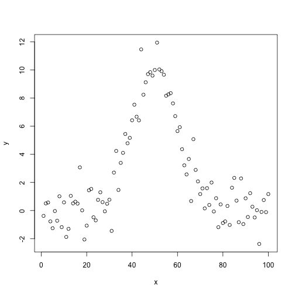
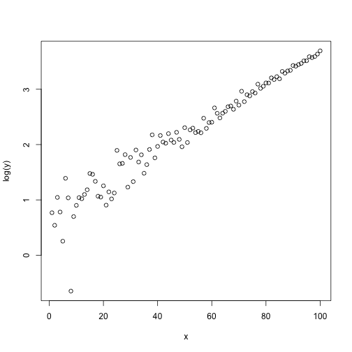
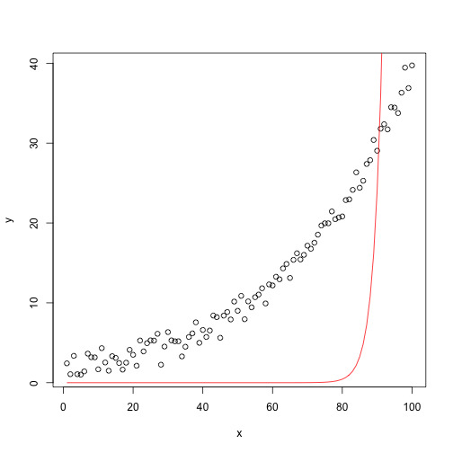
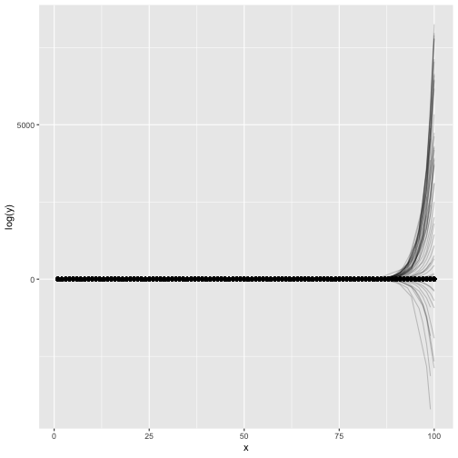
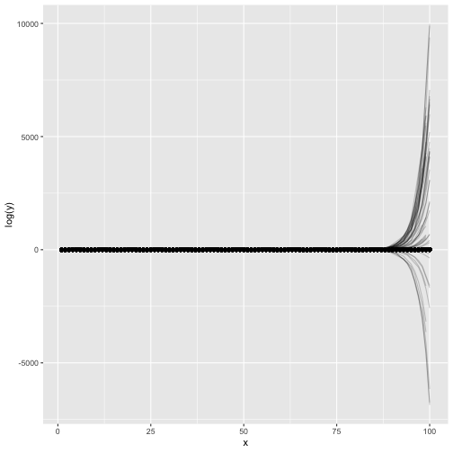

Approaches to fitting non-linear models
===
author: Etienne Low-Décarie
date: 12 July 2018
autosize: true

Gettint to know each other
===

<div align="center">
You?
<div>

***

Workshop
- Peer teaching and coding
  - I am one of your peers... correct me when I am wrong.
- Post its
- Challenges


Schedule
===

- least-squares optimisation
- linear models of curves and linearization
- **~10:30AM - 30 minute coffee break**
- non-linear least squares
- **~12:30PM - 60 minute lunch break**

***

- maximum likelihood approaches
- expansions
- other approaches to estimating prediction error
  - boostrapping
  - Monte-Carlo simulations
- **~15:30AM - 30 minute break**
- Dojo and/or work on your experiment
  
Data sets
===

`agridat::carmer.density`  
`FSA::Ecoli`

a package dedicated to this kind of datasets:

```r
require(NISTnls)
help(package="NISTnls")
plot(Thurber)
```


Simulating your data
===

Good for learning and testing:
- we will know the true functional form
- we will know error is normally distributed
  - or choose another error distribution


Simulating your data : quadratic
===

\[\Delta N = r(K-\alpha N)N\]

Curved but linear in parameters

```r
x <- 1:100
a <- 0.005 ; b <- -0.5 ; c <- 10
quadratic_data <- data.frame(x=x,
                            y=a*x^2+b*x+c+rnorm(length(x)))
```
each term is either a constant or the product of a parameter and a predictor variable, the predictor variable can be transformed in one of the terms (log, squared, inverse...) 

***


```r
plot(quadratic_data)
```


Simulating your data: exponential
===

curved and non-linear in parameters, but transformable

\[N_t = N_0e^{(rt)}\]


```r
x <- 1:100
a <- 2 ;b <- 0.03
exp_data <- data.frame(x=x,
                            y=a*exp(b*x)+rnorm(length(x)))
```
here, *e* is raised to the power of the product of a parameter and a predictor variable

***


```r
plot(exp_data)
```


Simulating your data
===

curved and non-linear in parameters: gaussian function

```r
x <- 1:100
a <- 10 ; b <- 50 ; c <- 0.1
gaussian_data <- data.frame(x=x,
                            y=a*exp(-((x-b)^2)/2*c^2)+rnorm(length(x)))
```
here, the square is taken of difference between a parameter and a predictor variable, *e* is raised to the power of a ratio that includes parameters and a predictor variable,...
***


```r
plot(gaussian_data)
```



Simulating your data : logistic growth
===

\[\frac{dN}{dt} = rN(\frac{K-N}{K})\]


\[N_t = \frac{K}{1+(\frac{K}{N_0}-1)e^{(-rt)}}\]

curved and non-linear in parameters

```r
t <- 1:100
P0 <- 5 ; K <- 100 ; r <- 0.08
logistic_growth_data <- data.frame(x=t,
                            y=(K*P0*exp(r*t))/(K+P0*(exp(r*t)-1))+5*rnorm(length(t)))
```

***


```r
plot(logistic_growth_data)
```


Simulating your data
===

Convoluted (many parameters) : Fourier 

```r
x <- 1:100
conv2_data = data.frame(x=x,
                        y=1 * cos(x + 2) + (3 * cos(2*x + 4) + 5))
```

***


```r
plot(conv2_data)
lines(conv2_data)
```


  
Least-squares optimisation
===


Least-squares optimisation
===


Least-squares optimisation
===


```r
require(animation)
saveGIF(least.squares(),
        movie.name="least_squares.gif")
```

```
[1] TRUE
```

***


Least-squares optimisation
===

```r
saveGIF(grad.desc(),
         movie.name="gradient_descent.gif")
```

```
[1] TRUE
```

***


Linearization
===

- segmentation
- transformation
- I()

Linearization : segmentation
===

```r
require(segmented)
lm_fit <- lm(cells~days,
                  data=FSA::Ecoli)
plot(cells~days,
     data=FSA::Ecoli)
lines(FSA::Ecoli$days, predict(lm_fit), col="red")
```


Linearization : segmentation
===

```r
segmented_fit <- segmented(lm_fit)
plot(cells~days,
     data=FSA::Ecoli)
lines(FSA::Ecoli$days, predict(segmented_fit), col="red")
```


Linearization : segmentation
===

```r
summary(segmented_fit)
```

```

	***Regression Model with Segmented Relationship(s)***

Call: 
segmented.lm(obj = lm_fit)

Estimated Break-Point(s):
   Est. St.Err 
 5.965  0.714 

Meaningful coefficients of the linear terms:
            Estimate Std. Error t value Pr(>|t|)   
(Intercept)  -2.0016     0.6794  -2.946  0.04214 * 
days          1.3208     0.2049   6.447  0.00298 **
U1.days      -1.2670     0.5018  -2.525       NA   
---
Signif. codes:  0 '***' 0.001 '**' 0.01 '*' 0.05 '.' 0.1 ' ' 1

Residual standard error: 0.6478 on 4 degrees of freedom
Multiple R-Squared: 0.9655,  Adjusted R-squared: 0.9397 

Convergence attained in 2 iterations with relative change 0 
```

Linearization: transformation
===


```r
plot(log(y)~x, data=exp_data)
```


Linearization: transformation
===


```r
lm_exp_fit <- lm(log(y)~x,
                 data=exp_data)
plot(exp_data)
lines(exp_data$x, exp(predict(lm_exp_fit)), col="red")
```



Linearization: transformation
===
problems?


```r
par(mfrow=c(2,2))
plot(lm_exp_fit)
```


```r
par(mfrow=c(1,1))
```

Linearization: curved linear models I()
===


```r
lm_quadratic_fit <- lm(y~x+I(x^2), data=quadratic_data)
plot(quadratic_data)
lines(quadratic_data$x, predict(lm_quadratic_fit), col="red")
```


Linearization: curved linear models I()
===

problems?

```r
par(mfrow=c(2,2))
plot(lm_quadratic_fit)
```


```r
par(mfrow=c(1,1))
```

Challenges
===

- Compare segmentation to transformation for `exp_data`
- Try fitting:
  - `gaussian_data`
  - `logistic_growth_data`
  - or even `conv2_data`
- with a combination of
  - segmentation
  - linear fitting of a curve using `I()`
  - and/or transformation


Nonlinear least-squares using nls()
===

Exponential

```r
nls_exp_fit <- nls(formula = y~ a*exp(b*x),
                   start = list(a=1,b=0.1),
                   data=exp_data)
summary(nls_exp_fit)
```

```

Formula: y ~ a * exp(b * x)

Parameters:
   Estimate Std. Error t value Pr(>|t|)    
a 2.1006416  0.0716419   29.32   <2e-16 ***
b 0.0293758  0.0003998   73.47   <2e-16 ***
---
Signif. codes:  0 '***' 0.001 '**' 0.01 '*' 0.05 '.' 0.1 ' ' 1

Residual standard error: 1.071 on 98 degrees of freedom

Number of iterations to convergence: 14 
Achieved convergence tolerance: 4.304e-10
```

***


```r
plot(exp_data)
lines(exp_data$x, predict(nls_exp_fit), col="red")
```


Nonlinear least-squares using nls()
===

logistic

```r
nls_logistic_fit <- nls(formula = y~(K*P0*exp(r*x))/(K+P0*(exp(r*x)-1)),
                   start = list(P0=20,r=1,K=200),
                   data=logistic_growth_data)
summary(nls_logistic_fit)
```

```

Formula: y ~ (K * P0 * exp(r * x))/(K + P0 * (exp(r * x) - 1))

Parameters:
    Estimate Std. Error t value Pr(>|t|)    
P0  4.391774   0.482313   9.106 1.14e-14 ***
r   0.084992   0.003316  25.628  < 2e-16 ***
K  98.109536   0.989566  99.144  < 2e-16 ***
---
Signif. codes:  0 '***' 0.001 '**' 0.01 '*' 0.05 '.' 0.1 ' ' 1

Residual standard error: 4.716 on 97 degrees of freedom

Number of iterations to convergence: 9 
Achieved convergence tolerance: 3.16e-06
```

***


```r
plot(logistic_growth_data)
lines(logistic_growth_data$x, predict(nls_logistic_fit), col="red")
```


Starting values
===

Error due to starting values

```r
nls_exp_fit <- nls(formula = y~ a*exp(b*x),
                   start = list(a=1,b=0.4),
                   data=exp_data)
```

```
Error in nls(formula = y ~ a * exp(b * x), start = list(a = 1, b = 0.4), : number of iterations exceeded maximum of 50
```

***


```r
nls_logistic_fit <- nls(formula = y~(K*P0*exp(r*x))/(K+P0*(exp(r*x)-1)),
                   start = list(P0=200,r=1,K=1000),
                   data=logistic_growth_data)
```

```
Error in nls(formula = y ~ (K * P0 * exp(r * x))/(K + P0 * (exp(r * x) - : singular gradient
```

Starting values
===

"robust" algorithms : [Levenberg-Marquardt](https://en.wikipedia.org/wiki/Levenberg–Marquardt_algorithm)

```r
require(minpack.lm)
robust_nls_exp_fit <- nlsLM(formula = y~ a*exp(b*x),
                   start = list(a=1,b=0.4),
                   data=exp_data)
summary(robust_nls_exp_fit)
```

```

Formula: y ~ a * exp(b * x)

Parameters:
   Estimate Std. Error t value Pr(>|t|)    
a 2.387e-14  1.943e-13   0.123    0.902    
b 4.000e-01  8.207e-02   4.874 4.22e-06 ***
---
Signif. codes:  0 '***' 0.001 '**' 0.01 '*' 0.05 '.' 0.1 ' ' 1

Residual standard error: 756.4 on 98 degrees of freedom

Number of iterations to convergence: 2 
Achieved convergence tolerance: 1.49e-08
```

***


```r
plot(exp_data)
lines(exp_data$x, predict(robust_nls_exp_fit), col="red")
```



Starting values
===

"robust" algorithms : [Levenberg-Marquardt](https://en.wikipedia.org/wiki/Levenberg–Marquardt_algorithm)


```r
nls_logistic_fit <- nlsLM(formula = y~(K*P0*exp(r*x))/(K+P0*(exp(r*x)-1)),
                   start = list(P0=200,r=1,K=1000),
                   data=logistic_growth_data)
summary(nls_logistic_fit)
```

```

Formula: y ~ (K * P0 * exp(r * x))/(K + P0 * (exp(r * x) - 1))

Parameters:
    Estimate Std. Error t value Pr(>|t|)    
P0  4.391762   0.482312   9.106 1.14e-14 ***
r   0.084992   0.003316  25.628  < 2e-16 ***
K  98.109523   0.989565  99.144  < 2e-16 ***
---
Signif. codes:  0 '***' 0.001 '**' 0.01 '*' 0.05 '.' 0.1 ' ' 1

Residual standard error: 4.716 on 97 degrees of freedom

Number of iterations to convergence: 36 
Achieved convergence tolerance: 1.49e-08
```

***


```r
plot(logistic_growth_data)
lines(logistic_growth_data$x, predict(nls_logistic_fit), col="red")
```


Algorithms
===

nls:
- Gauss-Newton algorithm
- `plinear`: Golub-Pereyra algorithm
- `port`: nl2sol : upper and lower limits

nlsLM
- Levenberg-Marquardt

nls2:
- brute-force/grid search


Starting values
===

`?selfStart()`

```r
ss_nls_logistic_fit <- nls(y ~ SSlogis(x, Asym, xmid, scal),
           data = logistic_growth_data)
summary(ss_nls_logistic_fit)
```

```

Formula: y ~ SSlogis(x, Asym, xmid, scal)

Parameters:
     Estimate Std. Error t value Pr(>|t|)    
Asym  98.1095     0.9896   99.14   <2e-16 ***
xmid  36.0098     0.5345   67.38   <2e-16 ***
scal  11.7658     0.4591   25.63   <2e-16 ***
---
Signif. codes:  0 '***' 0.001 '**' 0.01 '*' 0.05 '.' 0.1 ' ' 1

Residual standard error: 4.716 on 97 degrees of freedom

Number of iterations to convergence: 0 
Achieved convergence tolerance: 2.602e-06
```

***


```r
plot(logistic_growth_data)
lines(logistic_growth_data$x, predict(nls_logistic_fit), col="red")
```


Challenge
===

- Use nls and nlsLM to fit:
  - `quadratic_data`
  - `gaussian_data`
  - `conv2_data`
  - your ownd data
- compare the fit of quadratic model on gaussian data and vis-versa
  - reduce the quality of the data and repeat the cross-fitting
    - increase error
    - decrease number of data points
    
    
Extracting data from your model
===


```r
coef(nls_logistic_fit)
```

```
         P0           r           K 
 4.39176171  0.08499223 98.10952309 
```

```r
confint(nls_logistic_fit)
```

```
          2.5%        97.5%
P0  3.49848855   5.39989204
r   0.07871143   0.09182942
K  96.19124980 100.12396569
```
...


Extracting data from your model the **tidy** way
===


```r
require(broom)
require(ggplot2)
nls_logistic_augment <- augment(nls_logistic_fit)
p <- qplot(data=nls_logistic_augment,
           x=x,
           y=y)+
  geom_line(aes(y=.fitted), colour="red")
```


Extracting data from your model the ,<\b>tidy<\b> way
===

Create more complicated dataset

```r
treatmentA <- logistic_growth_data
treatmentA$treatment <- "A"
treatmentA$y <- treatmentA$y + 5
treatmentB <- logistic_growth_data
treatmentB$treatment <- "B"
experiment <- rbind(treatmentA,treatmentB)
```

Extracting data from your model the ,<\b>tidy<\b> way
===


```r
require(dplyr)
group_fit <- experiment %>% group_by(treatment) %>%
  do(tidy(nls(y ~ SSlogis(x, Asym, xmid, scal),
           data = .)))
group_fit
```

```
# A tibble: 6 x 6
# Groups:   treatment [2]
  treatment term  estimate std.error statistic  p.value
  <chr>     <chr>    <dbl>     <dbl>     <dbl>    <dbl>
1 A         Asym     104.      1.05       99.4 2.09e-99
2 A         xmid      34.6     0.552      62.7 2.48e-80
3 A         scal      13.0     0.482      26.9 8.81e-47
4 B         Asym      98.1     0.990      99.1 2.65e-99
5 B         xmid      36.0     0.534      67.4 2.88e-83
6 B         scal      11.8     0.459      25.6 5.61e-45
```

Extracting data from your model the ,<\b>tidy<\b> way
===


```r
group_fit <- experiment %>% group_by(treatment) %>%
  do(glance(nls(y ~ SSlogis(x, Asym, xmid, scal),
           data = .)))
group_fit
```

```
# A tibble: 2 x 9
# Groups:   treatment [2]
  treatment sigma isConv    finTol logLik   AIC   BIC deviance df.residual
  <chr>     <dbl> <lgl>      <dbl>  <dbl> <dbl> <dbl>    <dbl>       <int>
1 A          4.72 TRUE     6.93e-7  -295.  599.  609.    2159.          97
2 B          4.72 TRUE     2.60e-6  -295.  599.  609.    2157.          97
```

Likelihood approach
===

explanation on white board


Likelihood approach ("by hand")
===

```r
like.growth<-function(parameters=c(200, 0.5, 15,0.1), Nt_measured, Time){
    
    #Parameter extraction
    K<-parameters[1]
    r<-parameters[2]
    N0<-parameters[3]
    st.dev<-parameters[4]

    #Logistic growth model
    Nt<-(K*N0*exp(r*Time) ) / (K + N0 * (exp(r*Time)-1))

    #log likelihood estimate
    #Nomral distribution
    log_likelihood<- -sum(dnorm(Nt_measured, Nt, sd=1, log=T))

    return(log_likelihood)
    
  }
```


Likelihood approach
===

```r
mle_norm_fit<-optim(par=c(200, 0.5, 15,0.1),
           fn=like.growth,
           Nt_measured=logistic_growth_data$y,
           Time=logistic_growth_data$x)
```


Likelihood approach ("by hand")
===

```r
    K<-mle_norm_fit$par[1]
    r<-mle_norm_fit$par[2]
    N0<-mle_norm_fit$par[3]

plot(logistic_growth_data)
lines(logistic_growth_data$x,
      (K*N0*exp(r*logistic_growth_data$x) ) / (K + N0 * (exp(r*logistic_growth_data$x)-1)),
      col='red')
```


Expansions
===

Expansions including:
  - random factors / mixed effects
  - weighted regressions
  - ...
Can be done using:
lme4::nlmer
nlme:nlme


Challenge
===

- Simulated logistic growth with non-normal error (more logical, eg. logit?) and use mle to fit the new data


Estimating prediction error : boostrapping
===

Boostrapping: resampling with replacement
(ie same number of points, but some points get chosen many times)


```r
require(broom)
boot_data <- logistic_growth_data %>% bootstrap(100) %>%
  do(tidy(nls(y ~ SSlogis(x, Asym, xmid, scal),
           data = .)))
head(boot_data)
```

```
# A tibble: 6 x 6
# Groups:   replicate [2]
  replicate term  estimate std.error statistic  p.value
      <int> <chr>    <dbl>     <dbl>     <dbl>    <dbl>
1         1 Asym      98.2     1.05       93.9 5.01e-97
2         1 xmid      36.1     0.664      54.3 1.94e-74
3         1 scal      12.2     0.482      25.3 1.47e-44
4         2 Asym      98.5     1.01       97.8 9.52e-99
5         2 xmid      36.4     0.613      59.4 4.35e-78
6         2 scal      11.8     0.471      25.2 2.73e-44
```


Estimating prediction error : boostrapping
===


```r
require(broom)
boot_data %>% group_by(term) %>% summarize(low=quantile(estimate, 0.05 / 2),
                                         high=quantile(estimate, 1 - 0.05 / 2))
```

```
# A tibble: 3 x 3
  term    low  high
  <chr> <dbl> <dbl>
1 Asym   96.5 100.0
2 scal   11.0  12.6
3 xmid   34.9  37.0
```

Estimating prediction error : boostrapping
===

Issues?


Estimating prediction error : boostrapping
===

Issues?

```r
boot_data <- exp_data %>% bootstrap(100) %>%
  do(tidy(nlsLM(formula = y~ a*exp(b*x),
                   start = list(a=1,b=0.4),
                   data=.)))

boot_data %>% group_by(term) %>% 
  summarize(low=quantile(estimate, 0.05 / 2),
            high=quantile(estimate, 1 - 0.05 / 2))
```

```
# A tibble: 2 x 3
  term        low     high
  <chr>     <dbl>    <dbl>
1 a     -1.56e-14 2.52e-10
2 b      2.66e- 1 4.00e- 1
```

Estimating prediction error : boostrapping
===

Issues?


```r
boot_data_aug <- exp_data %>% bootstrap(100) %>%
  do(augment(nlsLM(formula = y~ a*exp(b*x),
                   start = list(a=1,b=0.4),
                   data=.)))

p <- qplot(data=boot_data_aug,
           x=x,
           y=log(y))+
  geom_line(aes(y=.fitted, group=replicate), alpha=.2)
```

***


```r
print(p)
```




Estimating prediction error :  Monte-Carlo simulations
=== 

[predictNLS (Part 1, Monte Carlo simulation): confidence intervals for ‘nls’ models](https://rmazing.wordpress.com/2013/08/14/predictnls-part-1-monte-carlo-simulation-confidence-intervals-for-nls-models/)


```r
require(propagate)
mc_predicted <- predictNLS(nls_logistic_fit, nsim = 100000)
mc_predicted <- mc_predicted$summary
save(mc_predicted, file='./Data/mc_predicted.RData')
```

Estimating prediction error :  Monte-Carlo simulations
=== 

```r
load('../Data/mc_predicted.RData')
plot(logistic_growth_data)
lines(logistic_growth_data$x,
      mc_predicted[,"Sim.2.5%"], col='red')
lines(logistic_growth_data$x,
      mc_predicted[,"Sim.97.5%"], col='red')
```



Estimating prediction error :  Monte-Carlo simulations
=== 

Issues?


Next steps
===

- brms : Bayesian generalized multivariate non-linear multilevel models using Stan
  - great explanations in vignette
- Multi-demensional
- Equation systems
- ...

***


References and ressources
===
[NCEAS non-linear modeling working group](https://groups.nceas.ucsb.edu/non-linear-modeling)

[similar tutorial](http://rstudio-pubs-static.s3.amazonaws.com/28730_850cac53898b45da8050f7f622d48927.html)
